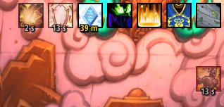

# Nocturnal Donut
### Replacement buff visualization

I figured I'd use some buzzwords. Basically, it's the simplest little thing ever. Just a skin to the buffs, nothing more nothing less. I'd like to say it's the best thing since sliced bread; but it's not. It's just my personal setup.

### Issues
There are NO options in the GUI, this is a WIP. You can however find basic config in the lua files.